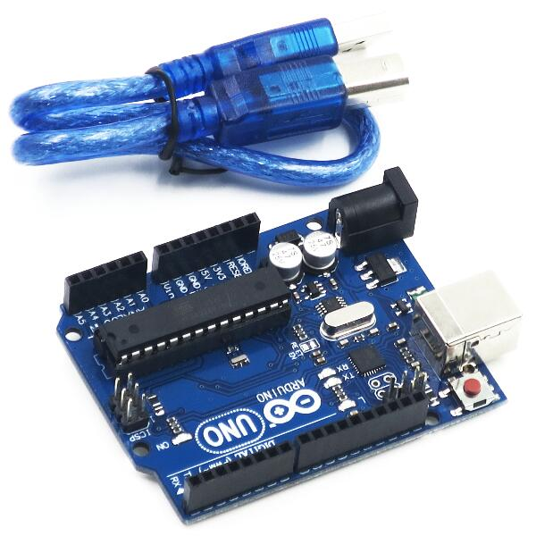
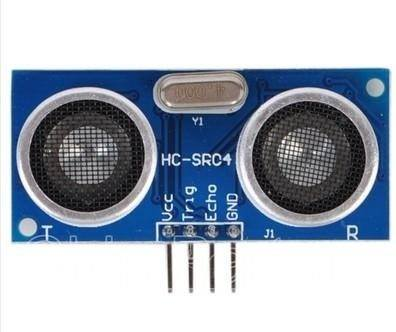
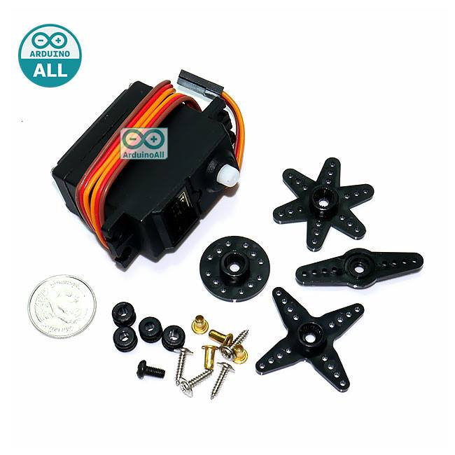
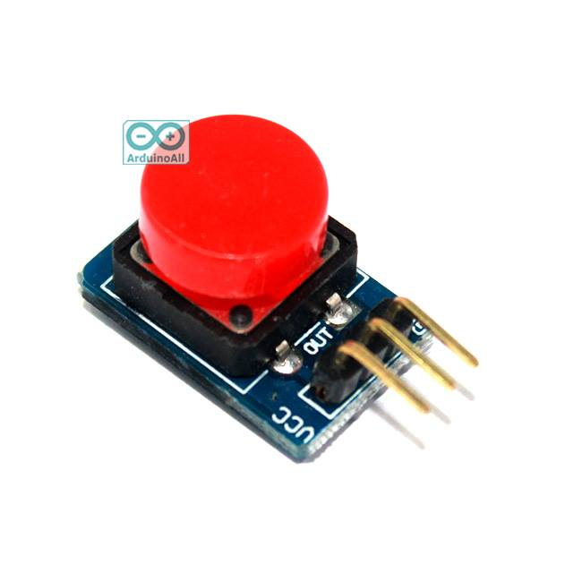
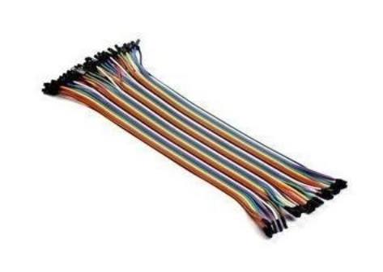
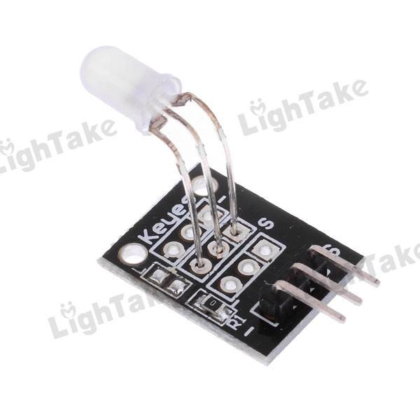

# :dog: Pet feeder :cat:
---
## Abstract &nbsp;:bookmark_tabs:
 * เนื่องด้วยปัจจุบัน ผู้คนมากมายล้วนมีสัตว์เลี้ยงที่ต้องให้อาหารเป็นประจำและมีปัญหากับการปล่อยให้สัตว์เลี้ยงต้องรออาหารเมื่อเวลาอาหารหมด ขี้เกียจที่จะลุกไปตักหรือเทอาหารให้สัตว์เลี้ยง หรือติดธุระปล่อยให้สัตว์เลี้ยงอยู่ในห้อง ในบ้านโดยลำพังโดยไม่มีใครให้อาหาร ทำให้สัตว์เลี้ยงต้องรอและมีอาการหิว และ การที่เทอาหารทิ้งไว้ในปริมาณมากหลายๆวัน สัตว์เลี้ยงจะรู้สึกว่าอาหารไม่สดใหม่ และไม่น่ากิน ทำให้สัตว์เลี้ยงไม่อยากอาหาร ต้องเททิ้งและเทให้ใหม่ซึ่งเป็นการสิ้นเปลืองดังนั้นกลุ่มของพวกเราจึงคิดค้นเครื่องให้อาหารสัตว์เลี้ยง ที่มีเซนเซอร์ตรวจจับว่าสัตว์เลี้ยงนั้นเดินมากินอาหาร แล้วเทอาหารมาโดยอัตโนมัติ และสามารถกดปุ่มเพื่อให้อาหารเทลงมาได้อีกด้วย นอกจากความสะดวกสบายในการให้อาหารสัตว์เลี้ยงแล้วยังเป็นการคงความสดของอาหารอีกด้วย
---
## Equipment &nbsp;:hammer:
---
| อุปกรณ์ที่ใช้ | รูปตัวอย่าง |
| --------- | --------- |
| Arduino Uno R3 |  |
| Ultrasonic SR04 |  |
| Servo SG5010 Standard Servo | |
| Button Switch   |    |
| Breadboard 400 holes  |  |
| Jump Wire(Male to Female) |   |
| 2-color LED module 5MM |  |
## Code &nbsp; :memo:

## Author Profile &nbsp;:family:
|  | Name | Student ID | &nbsp;&nbsp;&nbsp;&nbsp;&nbsp;&nbsp;&nbsp;Contacts |
| :-------- | :--------: | :--------: | :--------|
| |   นายคณิติน ผลงาม  |   61070340   |  |
| |นายสุชานนท์ วิโรจน์รัตน์ |61070246 |  |
| |นางสาวราโมน่า บราว|61070189|  |
|| นางสาวธรรมรัตน์ หาญประสพ | 61070083 |  |
# :dog: Pet feeder :cat:
---
## Abstract &nbsp;:bookmark_tabs:
 * เนื่องด้วยปัจจุบัน ผู้คนมากมายล้วนมีสัตว์เลี้ยงที่ต้องให้อาหารเป็นประจำและมีปัญหากับการปล่อยให้สัตว์เลี้ยงต้องรออาหารเมื่อเวลาอาหารหมด ขี้เกียจที่จะลุกไปตักหรือเทอาหารให้สัตว์เลี้ยง หรือติดธุระปล่อยให้สัตว์เลี้ยงอยู่ในห้อง ในบ้านโดยลำพังโดยไม่มีใครให้อาหาร ทำให้สัตว์เลี้ยงต้องรอและมีอาการหิว และ การที่เทอาหารทิ้งไว้ในปริมาณมากหลายๆวัน สัตว์เลี้ยงจะรู้สึกว่าอาหารไม่สดใหม่ และไม่น่ากิน ทำให้สัตว์เลี้ยงไม่อยากอาหาร ต้องเททิ้งและเทให้ใหม่ซึ่งเป็นการสิ้นเปลืองดังนั้นกลุ่มของพวกเราจึงคิดค้นเครื่องให้อาหารสัตว์เลี้ยง ที่มีเซนเซอร์ตรวจจับว่าสัตว์เลี้ยงนั้นเดินมากินอาหาร แล้วเทอาหารมาโดยอัตโนมัติ และสามารถกดปุ่มเพื่อให้อาหารเทลงมาได้อีกด้วย นอกจากความสะดวกสบายในการให้อาหารสัตว์เลี้ยงแล้วยังเป็นการคงความสดของอาหารอีกด้วย
---
## Equipment &nbsp;:hammer:
---
| อุปกรณ์ที่ใช้ | รูปตัวอย่าง |
| --------- | --------- |
| Arduino Uno R3 |  |
| Ultrasonic SR04 |  |
| Servo SG5010 Standard Servo | |
| Button Switch   |    |
| Breadboard 400 holes  |  |
| Jump Wire(Male to Female) |   |
| 2-color LED module 5MM |  |
## Code &nbsp; :memo:

## Author Profile &nbsp;:family:
|  | Name | Student ID | &nbsp;&nbsp;&nbsp;&nbsp;&nbsp;&nbsp;&nbsp;Contacts |
| :-------- | :--------: | :--------: | :--------|
| |   นายคณิติน ผลงาม  |   61070340   |  |
| |นายสุชานนท์ วิโรจน์รัตน์ |61070246 |  |
| |นางสาวราโมน่า บราว|61070189|  |
|| นางสาวธรรมรัตน์ หาญประสพ | 61070083 |  |
