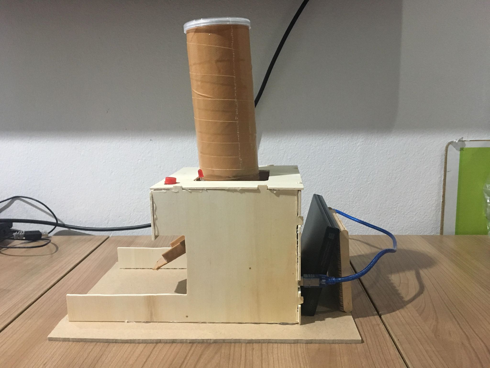
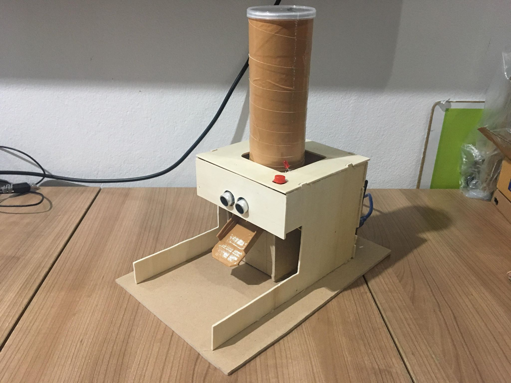
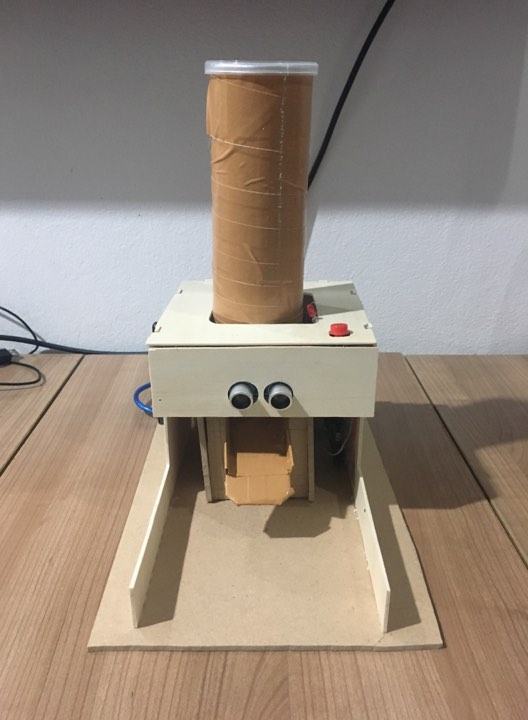

# :dog: Pet feeder :cat:

## บทคัดย่อ &nbsp;:bookmark_tabs:
 * เนื่องด้วยปัจจุบัน ผู้คนมากมายล้วนมีสัตว์เลี้ยงที่ต้องให้อาหารเป็นประจำและมีปัญหากับการปล่อยให้สัตว์เลี้ยงต้องรออาหารเมื่อเวลาอาหารหมด ขี้เกียจที่จะลุกไปตักหรือเทอาหารให้สัตว์เลี้ยง หรือติดธุระปล่อยให้สัตว์เลี้ยงอยู่ในห้อง ในบ้านโดยลำพังโดยไม่มีใครให้อาหาร ทำให้สัตว์เลี้ยงต้องรอและมีอาการหิว และ การที่เทอาหารทิ้งไว้ในปริมาณมากหลายๆวัน สัตว์เลี้ยงจะรู้สึกว่าอาหารไม่สดใหม่ และไม่น่ากิน ทำให้สัตว์เลี้ยงไม่อยากอาหาร ต้องเททิ้งและเทให้ใหม่ซึ่งเป็นการสิ้นเปลืองดังนั้นกลุ่มของพวกเราจึงคิดค้นเครื่องให้อาหารสัตว์เลี้ยง ที่มีเซนเซอร์ตรวจจับว่าสัตว์เลี้ยงนั้นเดินมากินอาหาร แล้วเทอาหารมาโดยอัตโนมัติ และสามารถกดปุ่มเพื่อให้อาหารเทลงมาได้อีกด้วย นอกจากความสะดวกสบายในการให้อาหารสัตว์เลี้ยงแล้วยังเป็นการคงความสดของอาหารอีกด้วย

## วัตถุประสงค์  &nbsp;:question:
* เพื่อให้สัตว์เลี้ยงมีอาหารกินในขณะที่เจ้าของไม่อยู่ และเพิ่มความสะดวกสบายในการให่อาหารสัตว์เลี้ยงเพียงแค่กดปุ่ม อีกทั้งยังถนอมอาหารอีกด้วย

## อุปกรณ์ &nbsp;:hammer:

| อุปกรณ์ที่ใช้ | รูปตัวอย่าง |
| --------- | --------- |
| Arduino Uno R3 |  |
| Ultrasonic SR04 |  |
| Servo SG5010 Standard Servo | |
| Button Switch   |    |
| Breadboard 400 holes  |  |
| Jump Wire(Male to Female) |   |
| 2-color LED module 5MM |  |
## อุปกรณ์อื่นๆ
* ไม้ฉลุ
* กล่องเลย์
* เทปกาว

## หลักการทำงาน   &nbsp; :wrench:
* เมื่อแมวเข้ามาใกล้ อาหารจะถูกปล่อยออกมา เมื่อสัตว์เลี้ยงกำลังกินอยู่ ภายใน 3 วินาที เครื่องก็จะปล่อยเพิ่มออกมา เมื่อสัตว์เลี้ยงออกจากsensorเครื่องก็จะหยุดทำงาน สามารถกดปุ่มเองได้เพื่อให้อาหารออกมา เมื่อเครื่องทำงานไฟ LED จะติด

## ภาพรวมงาน &nbsp;:camera:
* ภาพด้านข้าง

 

* ภาพด้านหน้า

## Code &nbsp; :mag_right:
#include <Servo.h>  
#define trigPin 7 
#define echoPin 6 

volatile int btnState = 0; 
const int buttonPin = 2; 
const int ledPin =  13; 
Servo servo; 
int servoState = 0; 
long distance = 0; 
long duration = 0; 

void setup() { 
&nbsp;&nbsp;&nbsp;&nbsp;&nbsp;&nbsp;&nbsp;&nbsp;Serial.begin (9600); 
&nbsp;&nbsp;&nbsp;&nbsp;&nbsp;&nbsp;&nbsp;&nbsp;pinMode(trigPin, OUTPUT); 
&nbsp;&nbsp;&nbsp;&nbsp;&nbsp;&nbsp;&nbsp;&nbsp;pinMode(echoPin, INPUT); 
&nbsp;&nbsp;&nbsp;&nbsp;&nbsp;&nbsp;&nbsp;&nbsp;pinMode(2, INPUT); 
&nbsp;&nbsp;&nbsp;&nbsp;&nbsp;&nbsp;&nbsp;&nbsp;pinMode(13, OUTPUT); 
&nbsp;&nbsp;&nbsp;&nbsp;&nbsp;&nbsp;&nbsp;&nbsp;servo.attach(8); 
&nbsp;&nbsp;&nbsp;&nbsp;&nbsp;&nbsp;&nbsp;&nbsp;pinMode(ledPin, OUTPUT); 
&nbsp;&nbsp;&nbsp;&nbsp;&nbsp;&nbsp;&nbsp;&nbsp;pinMode(buttonPin, INPUT); 
&nbsp;&nbsp;&nbsp;&nbsp;&nbsp;&nbsp;&nbsp;&nbsp;attachInterrupt(digitalPinToInterrupt(2), pin_ISR, RISING); 
&nbsp;&nbsp;&nbsp;&nbsp;&nbsp;&nbsp;&nbsp;&nbsp;servo.write(0); 
} 
void loop() {  
&nbsp;&nbsp;&nbsp;&nbsp;&nbsp;&nbsp;&nbsp;&nbsp;delay(500)  
&nbsp;&nbsp;&nbsp;&nbsp;&nbsp;&nbsp;&nbsp;&nbsp;servo.write(0); 
 &nbsp;&nbsp;&nbsp;&nbsp;&nbsp;&nbsp;&nbsp;&nbsp;digitalWrite(trigPin, LOW); 
&nbsp;&nbsp;&nbsp;&nbsp;&nbsp;&nbsp;&nbsp;&nbsp;delayMicroseconds(2); 
&nbsp;&nbsp;&nbsp;&nbsp;&nbsp;&nbsp;&nbsp;&nbsp;digitalWrite(trigPin, HIGH); 
&nbsp;&nbsp;&nbsp;&nbsp;&nbsp;&nbsp;&nbsp;&nbsp;delayMicroseconds(10); 
&nbsp;&nbsp;&nbsp;&nbsp;&nbsp;&nbsp;&nbsp;&nbsp;digitalWrite(trigPin, LOW); 
&nbsp;&nbsp;&nbsp;&nbsp;&nbsp;&nbsp;&nbsp;&nbsp;duration = pulseIn(echoPin, HIGH); 
&nbsp;&nbsp;&nbsp;&nbsp;&nbsp;&nbsp;&nbsp;&nbsp;distance = (duration/2) / 29.1; 
&nbsp;&nbsp;&nbsp;&nbsp;&nbsp;&nbsp;&nbsp;&nbsp;if (distance > 0 && distance < 20) { 
&nbsp;&nbsp;&nbsp;&nbsp;&nbsp;&nbsp;&nbsp;&nbsp;&nbsp;&nbsp;&nbsp;&nbsp;&nbsp;&nbsp;&nbsp;&nbsp;servo.write(90); 
&nbsp;&nbsp;&nbsp;&nbsp;&nbsp;&nbsp;&nbsp;&nbsp;&nbsp;&nbsp;&nbsp;&nbsp;&nbsp;&nbsp;&nbsp;&nbsp;delay(1000); 
&nbsp;&nbsp;&nbsp;&nbsp;&nbsp;&nbsp;&nbsp;&nbsp;&nbsp;&nbsp;&nbsp;&nbsp;&nbsp;&nbsp;&nbsp;&nbsp;servo.write(0); 
&nbsp;&nbsp;&nbsp;&nbsp;&nbsp;&nbsp;&nbsp;&nbsp;&nbsp;&nbsp;&nbsp;&nbsp;&nbsp;&nbsp;&nbsp;&nbsp;delay(3000); 
&nbsp;&nbsp;&nbsp;&nbsp;&nbsp;&nbsp;&nbsp;&nbsp;} 
} 
void pin_ISR() { 
&nbsp;&nbsp;&nbsp;&nbsp;&nbsp;&nbsp;&nbsp;&nbsp;servo.write(90); 
&nbsp;&nbsp;&nbsp;&nbsp;&nbsp;&nbsp;&nbsp;&nbsp;Serial.println("button"); 
&nbsp;&nbsp;&nbsp;&nbsp;&nbsp;&nbsp;&nbsp;&nbsp;btnState = digitalRead(buttonPin); 
&nbsp;&nbsp;&nbsp;&nbsp;&nbsp;&nbsp;&nbsp;&nbsp;digitalWrite(ledPin, btnState); 
&nbsp;&nbsp;&nbsp;&nbsp;&nbsp;&nbsp;&nbsp;&nbsp;delay(500); 
}

---

## Author Profile &nbsp;:family:
|  | Name | Student ID | &nbsp;&nbsp;&nbsp;&nbsp;&nbsp;&nbsp;&nbsp;Contacts |
| :-------- | :--------: | :--------: | :--------|
| |   นายคณิติน ผลงาม  |   61070340   |  |
| |นายสุชานนท์ วิโรจน์รัตน์ |61070246 |  |
| |นางสาวราโมน่า บราว|61070189|  |
|| นางสาวธรรมรัตน์ หาญประสพ | 61070083 |  |
---
