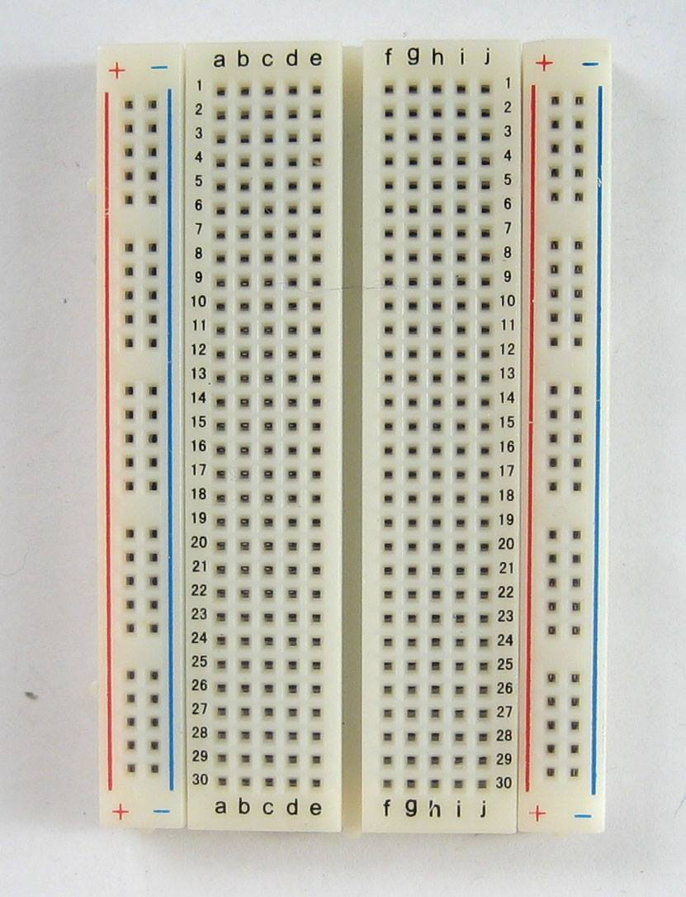

# :dog: Pet feeder :cat:
## Abstract
 * เนื่องด้วยปัจจุบัน ผู้คนมากมายล้วนมีสัตว์เลี้ยงที่ต้องให้อาหารเป็นประจำและมีปัญหากับการปล่อยให้สัตว์เลี้ยงต้องรออาหารเมื่อเวลาอาหารหมด ขี้เกียจที่จะลุกไปตักหรือเทอาหารให้สัตว์เลี้ยง หรือติดธุระปล่อยให้สัตว์เลี้ยงอยู่ในห้อง ในบ้านโดยลำพังโดยไม่มีใครให้อาหาร ทำให้สัตว์เลี้ยงต้องรอและมีอาการหิว และ การที่เทอาหารทิ้งไว้ในปริมาณมากหลายๆวัน สัตว์เลี้ยงจะรู้สึกว่าอาหารไม่สดใหม่ และไม่น่ากิน ทำให้สัตว์เลี้ยงไม่อยากอาหาร ต้องเททิ้งและเทให้ใหม่ซึ่งเป็นการสิ้นเปลืองดังนั้นกลุ่มของพวกเราจึงคิดค้นเครื่องให้อาหารสัตว์เลี้ยง ที่มีเซนเซอร์ตรวจจับว่าสัตว์เลี้ยงนั้นเดินมากินอาหาร แล้วเทอาหารมาโดยอัตโนมัติ และสามารถกดปุ่มเพื่อให้อาหารเทลงมาได้อีกด้วย นอกจากความสะดวกสบายในการให้อาหารสัตว์เลี้ยงแล้วยังเป็นการคงความสดของอาหารอีกด้วย
## equipment

